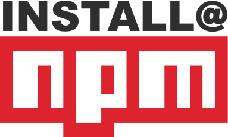

# gridsome-source-crypto-compare


 []()


A gridsome source plugin for the CryptoCompare API.   

## Install

- `yarn add gridsome-source-cryptocompare`
- `npm install gridsome-source-cryptocompare`


<a href="https://www.npmjs.com/package/gridsome-source-cryptocompare" rel="npm"></a>

## Features
To date the plugin only offers 'Toplist by 24H Volume Subscriptions' data.   Plans to addd more API calls are in the pipeline.

## Basic usage

When your the project has successfully built a success message will appear to indicate that the API has connected  and results have been returned successfully.


Custom options can be passed to the plugin, this should be done inside __gridsome.config.js__

```js
module.exports = {
  plugins: [
    {
      use: 'grid-source-crypto-compare',
      options: {
        apiKey: 'your-api-key',
        limit: 20,
        currency: 'EUR',
      }
    }
  ]
}
```
## Options

#### apiKey:
- Type: `string`
- Default:  `not-set`
- Required: `false`

_refer to the CryptoCompare API docs for more information about API keys:_
https://min-api.cryptocompare.com/documentation

#### limit:
- Type: `number`
- Default:  `10`
- Required: `false`

The number of coins to return in the toplist, default 10, min 10, max 100 will round to steps of 10 coins [ Min - 10] [ Max - 100] [ Default - 10]

#### page:
- Type: `number`
- Default:  `0`
- Required: `false`

The pagination for the request. If you want to paginate by 50 for example, pass in the limit_toplist param the value 50 and increasing page_toplist integer values, 0 would return coins 0-50, 1 returns coins 50-100 [ Min - 0] [ Default - 0]

#### currency:
- Type: `string`
- Default:  `'GPB'`
- Required: `true`

The currency symbol to convert into [ Min length - 1] [ Max length - 10]

#### ascending:
- Type: `boolean`
- Default:  `true`
- Required: `false`

#### sign:
- Type: `boolean`
- Default:  `false`
- Required: `false`

If set to true, the server will sign the requests (by default we don't sign them), this is useful for usage in smart contracts [ Default - false]

### Usage
https://min-api.cryptocompare.com/pricing

## Was this plugin useful?

If you found this template _useful_,
please ⭐️the project to show your appreciation!
<br>
In the spirit of open-source, share this project with others in the community who might find it useful 😀 


